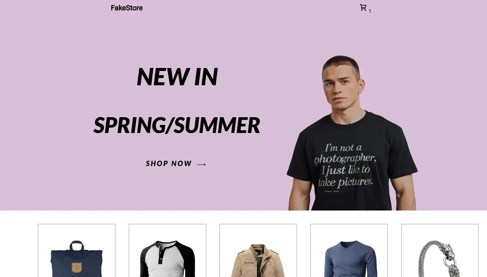

# Fake Store

Este es un proyecto que consume la "Fake Store API"

## Tecnologías Utilizadas  

- **REACT** 
- **CSS**
- **TYPESCRIPT**

## Funcionalidades

- **Visualización de productos**: La apliación muestra una lista de productos con detalles como imagen, precio, categoría.
- **Detalles del producto**: Al hacer click en un producto, los usuarios pueden ver una página con información mas detallada.
- **Bolsa de compra**: Un resumen de los productos seleccionados y su costo total antes de procedes al pago
- **Carrito de compra**: Los usuarios pueden añadir productos al carrito y gestionarlo (añadir, eliminar, actualizar cantidades).
- **Pasarela de pago**: Los usuarios pueden simular un proceso de compra mediante una pasarela de pago(STRIPE).
- **Diseño responsivo**: Adaptable a diferentes tamaños de pantalla

